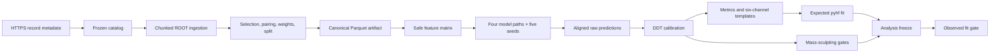

# Software Architecture 2.0.0

## Dataflow

## Modules

| Module | Responsibility |
|---|---|
| `catalog` | direct-HTTPS metadata, classification, catalog validation |
| `ingestion` | chunked ROOT reads, unit conversion, Parquet publication |
| `physics` | four-vectors, pairing, event selection, kinematics |
| `weights` | signed yield weights and absolute class-normalized train weights |
| `splits` | deterministic identity and per-dataset hash buckets |
| `features` | frozen dimensionless features and forbidden-field enforcement |
| `models` | four model families, five seeds, prediction alignment |
| `decorrelation` | conditional CDF, adaptive bins, sculpting gates |
| `inference` | templates, non-positive-bin merging, pyhf workspace and fit |
| `blinding` | freeze creation/validation and observed-fit refusal |
| `artifacts` | canonical hashing and atomic publication |
| `contracts` | Draft 2020-12 schema and strict YAML validation |
| `reporting` | blinded, artifact-derived Markdown report |
| `cli` | breaking v2 command orchestration |

## Trust boundaries

External record metadata and ROOT files are untrusted until URL policy,
checksum, schema, units, and required branches pass. Canonical Parquet is the
training boundary. A feature matrix is untrusted until the serialized field
list passes the forbidden-field policy. A freeze is untrusted until its
self-hash and all referenced hashes match.

## Artifact protocol

Formal commands write to a unique `.partial.<uuid>` directory, validate and hash
payloads, rename atomically, and write `completion.json`. Existing formal
outputs are never overwritten. A completion record binds writer version,
configuration hash, input hashes, payload hashes, and aggregate artifact hash.
